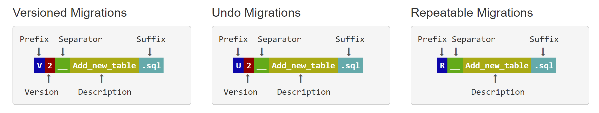
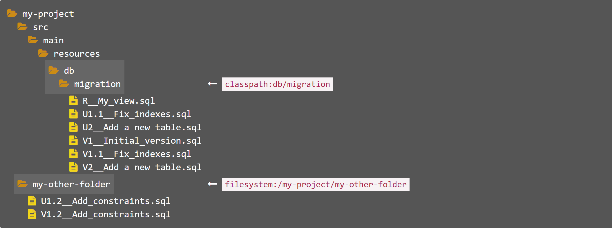

# flyway使用

## 资料

- Flyway官网：[flywaydb.org](https://flywaydb.org/)

- Flyway Github 仓库：[flyway / flyway](https://github.com/flyway/flyway)

- Flyway Maven 仓库：[Home » org.flywaydb » flyway-core](https://mvnrepository.com/artifact/org.flywaydb/flyway-core)

## flyway介绍

Flyway是一个开源数据库迁移工具。与配置相比，它极力主张简单和约定。

它仅基于7个基本命令： 迁移， 清理， 信息， 验证， 撤消， 基线和 修复。

迁移可以用SQL （支持特定于数据库的语法（例如PL / SQL，T-SQL等）或Java （适用于高级数据转换或处理LOB）的方式编写。

它具有一个命令行客户端。如果您使用的是JVM，建议您在应用程序启动时使用Java API（也适用于Android）迁移数据库。或者，您也可以使用Maven插件 或Gradle插件。

如果还不够，那么可以使用Spring Boot，Dropwizard，Grails，Play，SBT，Ant，Griffon，Grunt，Ninja等插件！

支持的数据库包括 Oracle， SQL Server（包括Amazon RDS和Azure SQL数据库）， DB2， MySQL（包括Amazon RDS，Azure数据库和Google Cloud SQL）， Aurora
MySQL， MariaDB， Percona XtraDB群集， PostgreSQL（包括Amazon RDS，Azure数据库） ，Google Cloud SQL和Heroku）， Aurora PostgreSQL，
Redshift， CockroachDB， SAP HANA， Sybase ASE， Informix， H2， HSQLDB， Derby， Snowflake， SQLite和 Firebird。

## Flyway的迁移

Flyway中，对数据库的所有更改都称为`迁移(migrations)`。迁移可以是`版本控制(versioned)`或`可重复(repeatable)`的。

版本化迁移有2种形式：regular和undo。

注意：**undo为 Flyway Pro 的功能**，这里不做讨论。

### 版本化的迁移

`版本化的迁移(Versioned Migrations)`具有`版本(a version)`，`描述(a description)`和`校验和(a checksum)`。

版本必须是唯一的。

描述用于提供迁移说明信息，使您能够记住每个迁移的工作。

校验和用于检测意外更改。版本化迁移是最常见的迁移类型。它们仅按顺序应用一次。

版本迁移通常用于：

- 创建/更改/删除表/索引/外键/枚举/UDTs/…
- 参考数据更新
- 用户数据更正

一个简单的示例：

```sql
CREATE TABLE car (
    id INT NOT NULL PRIMARY KEY,
    license_plate VARCHAR NOT NULL,
    color VARCHAR NOT NULL
);

ALTER TABLE owner ADD driver_license_id VARCHAR;

INSERT INTO brand (name) VALUES ('DeLorean');
```

每个版本化的迁移必须分配一个唯一的版本。只要符合通常的点分符号，任何版本都是有效的。

在大多数情况下，只需要一个简单的递增整数即可。但是Flyway非常灵活，所有这些版本都是有效的版本迁移版本：

- 1
- 001
- 5.2
- 1.2.3.4.5.6.7.8.9
- 205.68
- 20130115113556
- 2013.1.15.11.35.56
- 2013.01.15.11.35.56

版本迁移按版本顺序应用。版本按照您通常期望的方式按数字排序。

### 可重复的迁移

`可重复的迁移(Repeatable Migrations)`有`描述(a description)`和`校验和(a checksum)`，但没有`版本(a version)`。每次校验和更改时（重新）应用它们，而不是仅运行一次。

在一次迁移运行中，在执行所有待处理的版本化迁移之后，始终将**最后一次应用可重复迁移**。可重复的迁移按其描述顺序应用。

默认情况下，版本化迁移和可重复迁移都可以用 SQL 或 Java 编写，并且可以包含多个语句。

Flyway会自动发现文件系统和 Java 类路径上的迁移。

为了跟踪何时以及由谁应用了哪些迁移，Flyway将模式历史记录表添加到了模式中。

可重复的迁移对于管理数据库对象非常有用，这些数据库对象的定义随后可以在版本控制中仅保存在单个文件中。它们通常用于

- （重新）创建视图/过程/功能/packages/…
- 重新插入批量参考数据

以下是可重复迁移的示例：

```sql
CREATE OR REPLACE VIEW blue_cars AS 
    SELECT id, license_plate FROM cars WHERE color='blue';
```

### 基于SQL的迁移

迁移最常用SQL编写。这样可以轻松上手并利用任何现有的脚本，工具和技能。它使您可以访问数据库的全部功能，而无需了解任何中间翻译层。

基于SQL的迁移通常用于

- DDL更改（TABLES，VIEWS，TRIGGERS，SEQUENCES等的CREATE / ALTER / DROP语句）
- 简单的参考数据更改（参考数据表中的CRUD）
- 简单的批量数据更改（常规数据表中的CRUD）

#### 命名

为了由Flyway接管，SQL迁移必须符合以下命名模式：



文件名由以下部分组成：

前缀：`V`用于版本控制（可配置）， `U`用于撤消（可配置）、`R`用于可重复迁移（可配置） 版本：带点或下划线的版本可根据需要将任意多个部分分开（不适用于可重复的迁移） 分隔符：`__`（两个下划线）（可配置）
说明：下划线或空格分隔单词 后缀：`.sql`（配置）

可选的版本化SQL迁移也可以省略分隔符和描述。

配置选项`validateMigrationNaming`决定了Flyway在执行迁移时如何处理与命名模式不符的文件：如果为true，则Flyway将仅忽略所有此类文件，如果为false，则Flyway将快速失败并列出所有需要更正的文件。

#### 发现

Flyway可以在文件系统和Java类路径上发现基于SQL的迁移。迁移驻留在该 `locations` 属性引用的一个或多个目录中。

- `filesystem:`前缀的位置以文件系统为目标。
- `classpath:`前缀的位置或带有前缀的位置以Java类路径为目标。



新的基于SQL的迁移是在运行时通过文件系统和Java类路径扫描自动发现的。一旦配置locations好要使用的SQL，只要新的SQL迁移符合配置的命名约定，Flyway就会自动选择它们。

此扫描是递归的。指定目录下非隐藏目录中的所有迁移也将被提取。

#### 句法

Flyway支持所有常规SQL语法元素，包括：

- 单行或多行语句
- 跨越整行的单（`-`）或多行（`/* */`）注释
- 特定于数据库的SQL语法扩展（PL/SQL, T-SQL, …）通常用于定义存储过程，程序包等。
- 此外，对于Oracle，Flyway还支持[SQL*Plus commands](https://flywaydb.org/documentation/database/oracle#sqlplus-commands)。

#### 占位符替换

除了常规的SQL语法外，Flyway还支持使用可配置的前缀和后缀替换占位符。

默认情况下，它会查找Ant风格的占位符，例如${myplaceholder}。这对于抽象环境之间的差异非常有用。

详情见[placeholders](https://flywaydb.org/documentation/placeholders)。

### 基于Java的迁移

基于Java的迁移非常适合使用SQL无法轻松表示的所有更改。

这些通常是这样的

- BLOB和CLOB的更改
- 高级批量数据更改（重新计算，高级格式更改，…）

这里省略，详情见官方文档中[java-based-migrations](https://flywaydb.org/documentation/migrations#java-based-migrations)。

## Spring Boot 项目整合使用 Flyway

项目中引入Maven依赖

```xml
<dependency>
    <groupId>org.flywaydb</groupId>
    <artifactId>flyway-core</artifactId>
</dependency>
```

application.properties配置文件中添加flyway配置：

```properties
# flyway
spring.flyway.enabled=true
spring.flyway.locations=classpath:db/migration
#spring.flyway.locations=filesystem:/my-project/my-other-folder
spring.flyway.sql-migration-prefix=V
spring.flyway.repeatable-sql-migration-prefix=R
spring.flyway.sql-migration-separator=__
spring.flyway.sql-migration-suffixes=.sql
```

配置参数说明：

- spring.flyway.enabled: 是否开启Flyway，默认为`true`
- spring.flyway.locations: Flyway迁移脚本路径，默认为`classpath:db/migration`
- spring.flyway.sql-migration-prefix: 版本化的迁移文件前缀，默认为`V`
- spring.flyway.repeatable-sql-migration-prefix: 可重复的迁移文件前缀，默认为`R`
- spring.flyway.sql-migration-separator: 迁移文件版本和说明之间的分隔符，默认为`__`
- spring.flyway.sql-migration-suffixes: 迁移文件后缀，默认为`.sql`

更多 Spring Boot 支持的 Flyway
可配置参数及说明见：[Application Properties - Data migration properties](https://docs.spring.io/spring-boot/docs/current/reference/html/appendix-application-properties.html#data-migration-properties)
