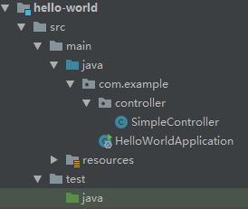
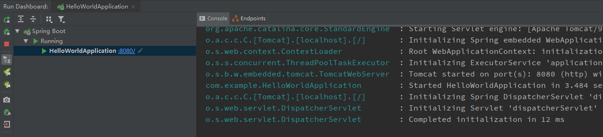
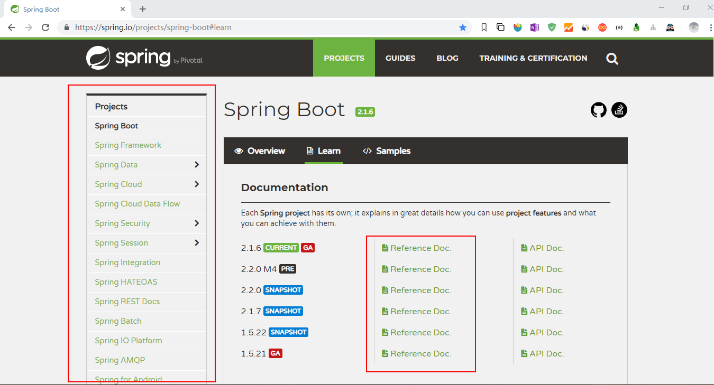
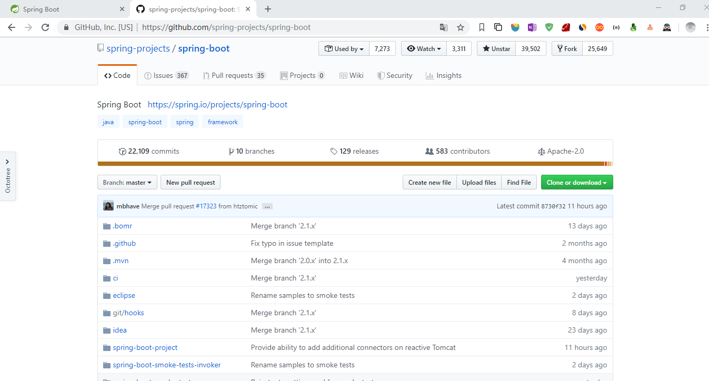

# 给世界的第一声问候

建立一个Spring Boot的Hello World项目非常简单，使用Spring官方提供的初始化工具创建项目：<https://start.spring.io>。

这里使用 `IntelliJ IDEA` 完成 `Hello World` 项目的创建。

> 新建一个Spring Initializr项目


> 勾选web依赖，完成项目创建

web依赖中包含Spring MVC和嵌入式的tomcat


> 完成项目创建后，在Application类同级目录下创建Controller类



```java
import org.springframework.web.bind.annotation.GetMapping;
import org.springframework.web.bind.annotation.RestController;

@RestController
public class SimpleController {

    @GetMapping("/")
    public String sayHello() {
        return "Hello,World!";
    }
}
```

> 启动项目，运行Application类的main方法


> 运行结果




运行成功，通过浏览器访问 **<http://localhost:8080/>** ，可以看到成功返回了Hello World。

## 结语

使用Spring Boot创建一个Hello World项目可以看到非常简单，但是需要一些前置条件,在IDE中配置好以下环境：

- java环境
- maven环境

## 资料

对于Spring Boot入门来说，一个Hello World只能看到它简化开发的一面，更详细准确的资料就要查询官网了。
Spring官方提供的文档非常详细，每个版本和每个整合的模块都有对应的文档，可以直接通过官网进行学习。

- [Spring Boot 开发文档地址](https://spring.io/projects/spring-boot#learn)



- [Spring Boot 项目 Github 地址](https://github.com/spring-projects/spring-boot)


